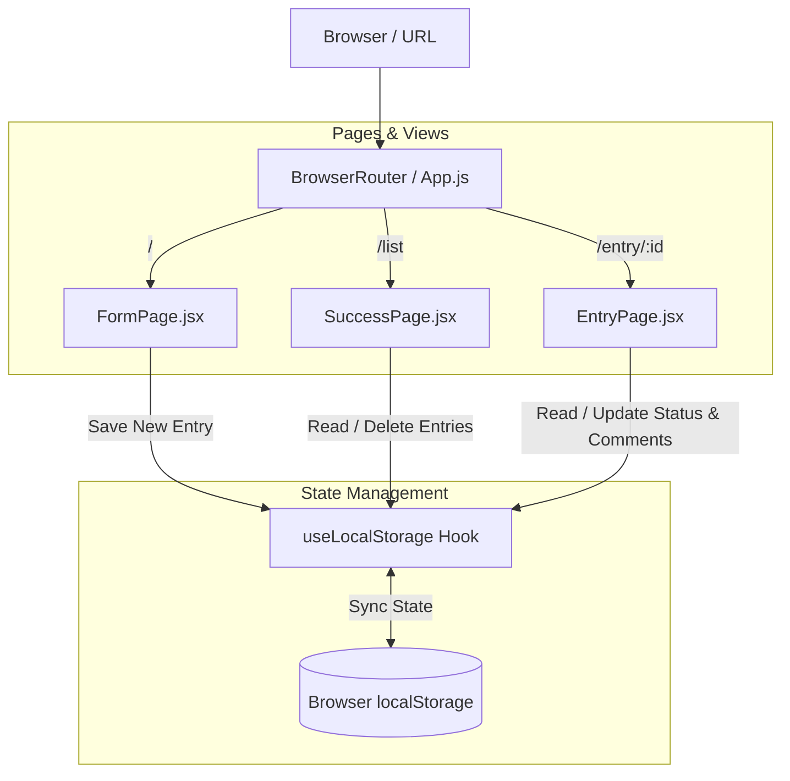
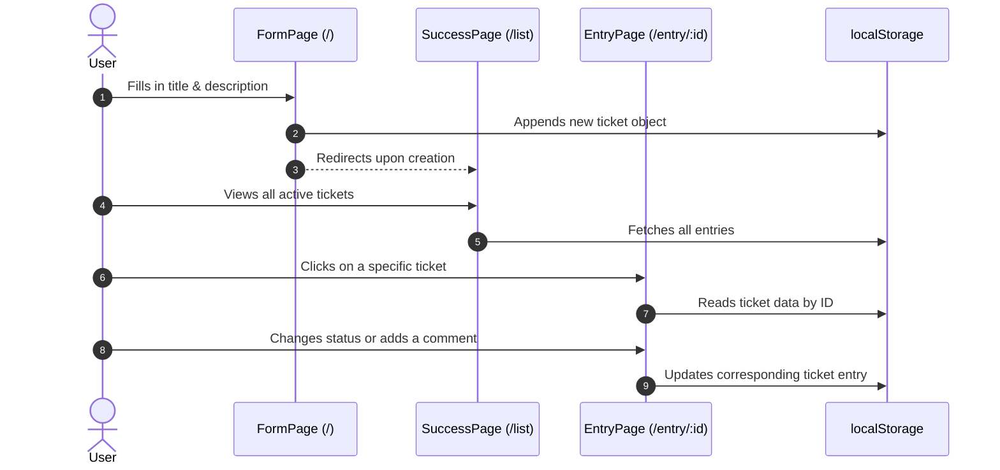
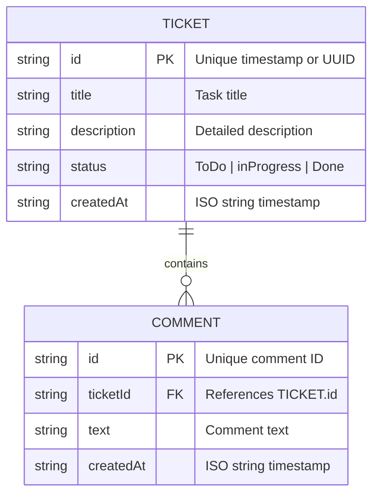

```markdown
#  FatFluence — React Ticket & Task Tracker

A minimalist, high-contrast ticket and task management web application built with **React**. **FatFluence** allows users to create tasks, manage workflows (`ToDo` → `inProgress` → `Done`), and leave comments on individual tickets — all with **100% client-side persistence** and zero backend dependencies.

---

##  Theme & Design Aesthetics

FatFluence uses a bold, eye-catching color palette (Black, Yellow, Red) designed for high readability, quick actions, and clear task status visibility.

---

##  Key Features

* **Ticket Creation:** Quickly spin up new tasks with a title and detailed description.
* **Workflow Management:** Update task status seamlessly on the ticket detail view.
* **Interactive Comments:** Add and delete comments per ticket for context and discussions.
* **Persistent Storage:** All tickets and comments automatically persist locally in the browser via `localStorage`.
* **Client-Side Routing:** Dynamic navigation powered by React Router v7.

---

##  Application Architecture & Data Flow

### 1. Component & Route Architecture



---

### 2. User Journey Sequence Diagram



---

### 3. Data Structure Model (`localStorage`)

The app stores data under a single key (`entries`) using the following JSON schema:



---

##  Tech Stack

* **Frontend Library:** [React 19](https://react.dev/)
* **Routing:** [React Router 7](https://reactrouter.com/)
* **Styling:** [Tailwind CSS](https://tailwindcss.com/)
* **Build Tooling:** [Create React App](https://create-react-app.dev/) (`react-scripts`)
* **State & Persistence:** Custom `useLocalStorage` React Hook

---

##  Project Structure

```text
fatfluence/
├── public/
│   └── index.html          # HTML shell, loads Tailwind CSS via CDN
├── src/
│   ├── components/
│   │   ├── FormPage.jsx    # "/" — Ticket creation form
│   │   ├── SuccessPage.jsx # "/list" — Overview list of all tickets
│   │   └── EntryPage.jsx   # "/entry/:id" — Single ticket detail view & comments
│   ├── hooks/
│   │   └── useLocalStorage.js # Custom hook for localStorage sync
│   ├── App.js              # Central routing definition
│   └── index.js            # Entry point wrapping App in BrowserRouter
└── package.json

```

---

## 🛣️ Routes Reference

| Path | Component | Description |
| --- | --- | --- |
| `/` | `FormPage` | Main entry point for creating new tickets |
| `/list` | `SuccessPage` | Overview table/list displaying all saved tickets |
| `/entry/:id` | `EntryPage` | Dynamic view to update status, read/add comments, or delete items |

---

##  Getting Started

### Prerequisites

* [Node.js](https://nodejs.org/) (v18.0.0 or higher recommended)
* `npm` or `yarn`

### Installation

1. **Clone the repository:**
```bash
git clone [https://github.com/dDaijin/fatfluence.git](https://github.com/dDaijin/fatfluence.git)
cd fatfluence

```


2. **Install dependencies:**
```bash
npm install

```


3. **Run locally:**
```bash
npm start

```


Open [http://localhost:3000/fatfluence](http://localhost:3000/fatfluence) to view the application in your browser (configured with `/fatfluence` base path).
4. **Build for production:**
```bash
npm run build

```


---

##  Technical Notes & Limitations

* **Client-Only Persistence:** All data lives strictly in your browser's `localStorage` under the `entries` key. Clearing your browser cache will permanently remove all tickets.
* **No Cross-Device Syncing:** Because there is no backend server or remote database, tickets will not sync across different devices or browsers.

---

##  License / Link

This project is released under the [MIT License](https://www.google.com/search?q=LICENSE).


```
https://ddaijin.github.io/fatfluence/
```
